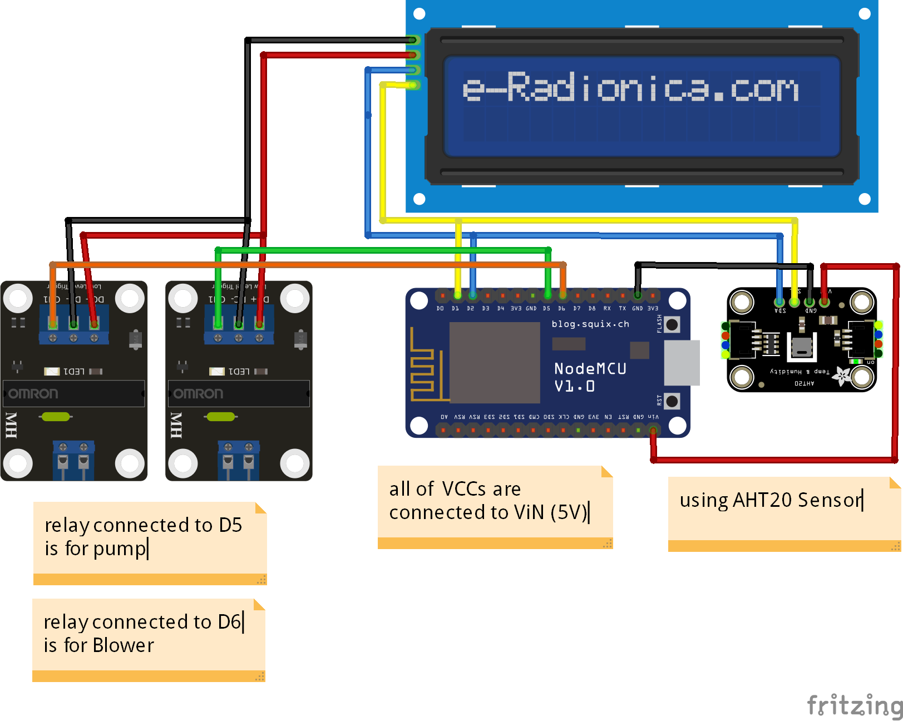

# Smart Farm for Oyster Mushroom Cultivation

## PREFACE
One of the prisons in Bandung called Sukamiskin Prison. They are cultivating oyster mushrooms as an activity for prisoner so that they can be more productive. And we as electrical engineering students were also invited to build an automation system for oyster mushroom cultivation. You can see documentation photos while we were building this tool in the documentation section

## PURPOSE
The aim of this project is to create an automatic remote control system based on the internet of things. With this tool, farmers can make activities that were previously done manually, now can be done via smartphone. The project is integrated by IoT technology using the blynk platform

## COMPONENTS
here's the component we need to build this project:
  1. **ESP8266**, I use NodeMCU for this project, you can use another dev board or microcontroller
  2. **AHT20**, this sensor is to measure the temperature and relative humidity, you can use another if you know how it works
  3. **2-channel relay**, as the action if the temperature or the relative humidity exceeds the given value
  4. **OLED Display 128x64**, it's also optional if you want to monitor the tools on the spot
  5. **and some of additional optional tool**

## Library I'm Using
  1. blynk, from library manager
  2. AHT20, from library manager (by Groove or Adafruit)
Thanks for community who has shared these powerful libraries

## Image
 

## Thanks To
  1. The Arduino Community and the internet
  2. My Friends  
    - Arizky Rahman  
    - Rifqi Haidar Ramdhani  
  3.  Myself @[Kevin Setya Nugraha](https://github.com/kvin-setya)  

## POST SCRIPT
